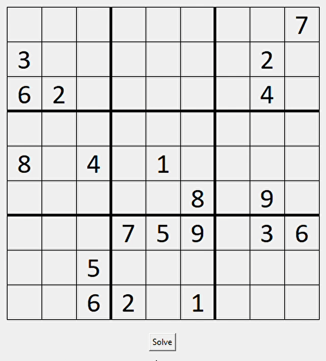

# Sudoku Solver

## Description:
- A python program that randomly generates a solvable Sudoku board and also solves it using the backtracking algorithm.
- The program also shows the steps followed by the algorithm through a GUI. This helps in visualizing how the algorithm works.

## How to Run:
- Head to the directory where the program is saved in the terminal.
- Enter `pip install -r requirements.txt`
- Wait for the dependencies to install.
- Now enter `python Sudoku_Solver.py`

## Demo:

